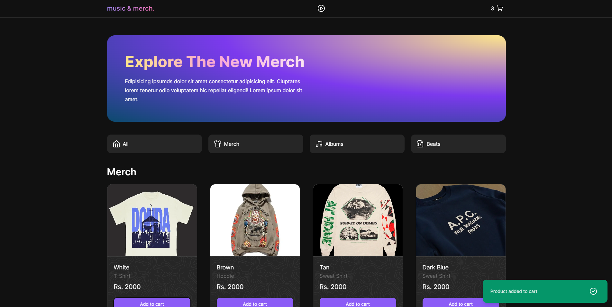

# music-merch-store

The Music and Merch App is a web application built using Next.js 13 with the App Router feature. This app provides a platform for users to discover and purchase music albums, merchandise, and related products of their favorite artists. The application leverages the power of React Context API for efficient state management, enabling a seamless user experience.

## Tech Stack

1. Next.js 13
2. React Context API
3. Tailind CSS

## Contribution

Contributions are welcome! If you find any bugs or want to contribute any features for app, feel free to submit a pull request. Make sure to follow the existing code style and adhere to the project's guidelines.

## License

This project is licensed under the MIT License.
